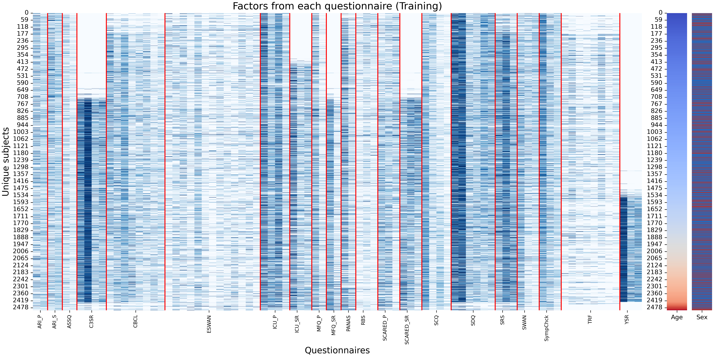
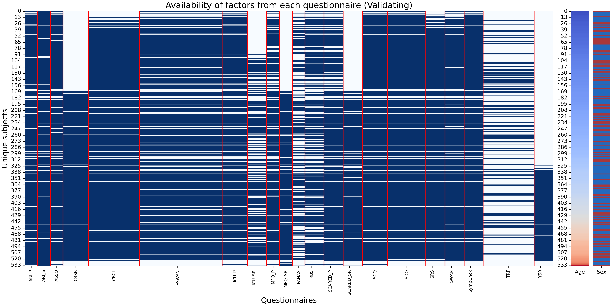
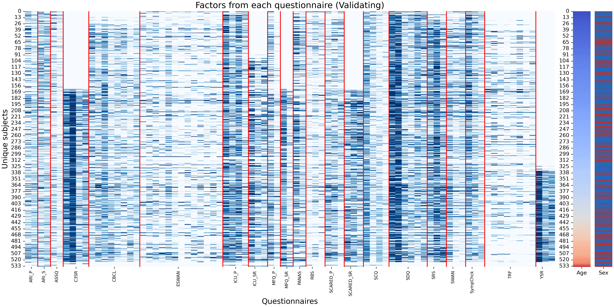
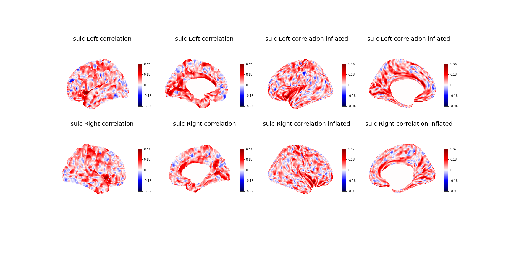
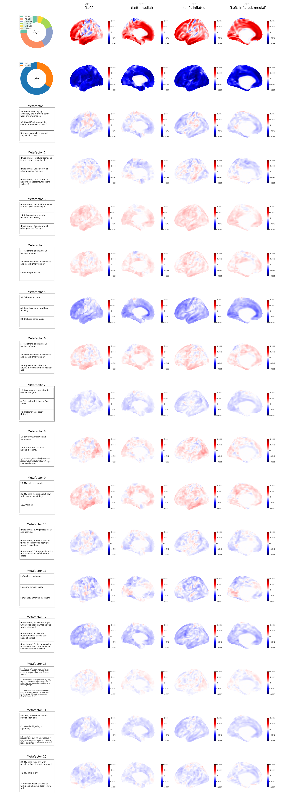
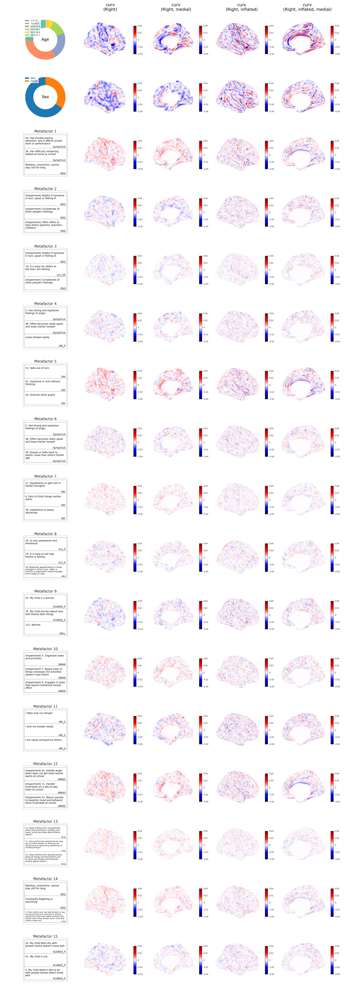
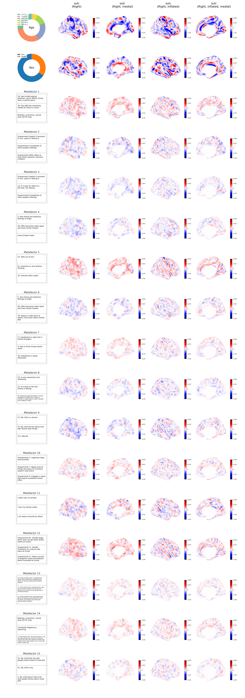
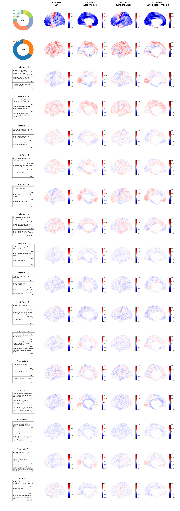

- [Meta-factor model: My God, it's full of Factors!](#meta-factor-model-my-god-its-full-of-factors)
  - [Introduction](#introduction)
  - [Historical background and motivation](#historical-background-and-motivation)
  - [What does this paper do?](#what-does-this-paper-do)
    - [Interpretable factorization of questionnaires](#interpretable-factorization-of-questionnaires)
    - [Meta-factorization of questionnaires](#meta-factorization-of-questionnaires)
    - [Micro-Meta-Factorization of questionnaires [need a better name]](#micro-meta-factorization-of-questionnaires-need-a-better-name)
    - [Prediction on Structural Brain Imaging](#prediction-on-structural-brain-imaging)

# Meta-factor model: My God, it's full of Factors!

## Introduction

## Historical background and motivation

- many questionnaires developed at different points in time, to get at different aspects of psychopathology
- generally, a questionnaire assumes one or more latent constructs, and is designed so that the presence of these can be quantified, e.g. by
  - calculation of subscales corresponding to the constructs (e.g. by tallying positive answers)
  - (exploratory/confirmatory) factor analysis of responses, with factors representing the degree to which a factor is present in each respondent
- problem 1: factor models are not necessarily interpretable
- problem 2: redundancy across questionnaires
- problem 3: no neurobiological basis for constructs

## What does this paper do?

### Interpretable factorization of questionnaires

- We introduce a new approach for factoring questionnaires that yields more interpretable factors, and apply it to CBCL and SDQ from HBN
- qualitative assessment: show the questions associated with factors, and that some factors can cross subscales

**CBCL question factor (proposed)**
<figure>

<figcaption align="left">
<b>Figure</b>: Question embedding of the CBCL questionnaire. Questions are sorted based on the CBCL subscales. Age (Old and Young) and gender (Femail and male) factors are set as confounders in the matrix decomposition model.
</figcaption> 
</figure>

  

  
Loadings of each CBCL question factor

  
  
  
  
  
  
  
  
  

  

  
CBCL question factor (Factor Analysis, promax rotation)

  <figure>
  

  <figcaption align="left">
  <b>Figure</b>: Question embedding obtained through Factor ANalysis with promax rotation for interpretability. The number of factors is determined by Bayesian Information Criterion (BIC).
  </figcaption>
  </figure>
  

  

  
CBCL question factor (Subscale)

  <figure>
  

  <figcaption align="left">
  <b>Figure</b>: CBCL-subscale. Questions in the same subscale group are equally weighted.
  </figcaption>
  </figure>
  

- quantitative assessment: show that the diagnostic classification performance from new factorization is indistinguishable for that using subscales or factors from factor analysis
<figure>

<figcaption align="left">
<b>Figure</b>: Prediction performance of each diagnostic classification (vertical axis) using factors of different dataset (horizontal axis) obtained by the proposed method. Datasets are grouped according to their universality. Left: cross-domain instruments or multi-questionnaires. The best performing factor is black framed. Right: diagnosis-specific instruments. The best performing factor is blue framed if it surpasses the corresponding cross-domain instruments, and red framed otherwise.
</figcaption>
</figure>

- quantitative assessment: apply to ABCD as well, and show that the loadings for factors are very similar between HBN and ABCD
<figure>

<figcaption align="left">
<b>Figure</b>: Question embedding of the CBCL questionnaire in ABCD dataset. The pattern of the factor loadings resemble to HBN's result. 
</figcaption>
</figure>

- how are our factors and subscales related (sankey plots for CBCL and SDQ)
<figure>

<figcaption align="left">
<b>Figure</b>: Sanky plot showing how CBCL variables (items in left-most column) are assigned: Proposed factors (Blue hubs, second column from left), factors obtained from Factor Analysis (Red hubs, right-most column) and CBCL-subscales (second column from right). Colors of the links are set based on CBCL-subscales.
</figcaption>
</figure>

### Meta-factorization of questionnaires

- We apply the interpretable factorization to the 21 questionnaires from the Healthy Brain Network dataset
- key point: compression does not lose information
- in the main paper, summarize main points (backed up by supplement)
  - who has filled what questionnaire
  <figure>
  

  <figcaption align="left">
  <b>Figure</b>: Subject response availability in different questionnaires. Subjects are sorted based on their ages in ascending order.
  </figcaption>
  </figure>
  <figure>
  

  <figcaption align="left">
  <b>Figure</b>: Normalized subject responses. The original response range is marked on the upper x-axis.
  </figcaption>
  </figure>
  

  
 Train-Validation-Test split 

    <figure>
    
    
    
    <figcaption align="left">
    <b>Figure</b>: Response availability of train, validation and test sets. A stratified split is performed based on ages (subdivided into 10 groups), gender (female and male) and response availability in each questionnaire. The train-validation-test ratio is (70%, 15%, 15%).
    </figcaption>
    </figure>
  

  - compression rate table (for our method vs subscales, if available)
  <figure align="center">
  
  </figure>
  - note that "disorder-specific" questionnaires don't do much better at predicting their respective diagnosis
  - possible heatmap: diagnosis vs scales (tile so that cross-domain instruments come first, then diagnostic-specific); ribbon of cross-diagnosis results do well
  - test per questionnaire (ours vs raw vs scale)
  <figure>
  

  <figcaption align="left">
  <b>Figure</b>: Prediction performance of each diagnostic classification (vertical axis) using available subscale of different dataset (horizontal axis).
  </figcaption>
  </figure>
- in the supplement
  - repeat the qualitative and quantitative assessments of CBCL and SDQ, with their respective subscales (if available)
  - heatmaps for FA
  <figure>
  

  <figcaption align="left">
  <b>Figure</b>: Prediction performance of each diagnostic classification (vertical axis) using factors of different dataset (horizontal axis) obtained by the Factor Analysis with promax rotation.
  </figcaption>
  </figure>
- We introduce a second level interpretable factorization approach -- meta-factors (factors of factors) -- and apply it to the factorizations of all the HBN questionnaires
- This yields a model with 15 meta-factors
  - level 1 (factors concatenated)
  <figure>
  
  

  <figcaption align="left">
  <b>Figure</b>: Factors obtained from each questionnaire are concatenated. Availability and the entries of the factors are shown. Since the factors are constrained to be bounded between 0 and 1, no normalization step is required.
  </figcaption>
  </figure>

  

  
 Concatenated factors for validation and test set 

  Validation set
  
  
  Test set
  
  
  

  - level 2 (factors of factors)
  <figure>
  

  <figcaption align="left">
  <b>Figure</b>: The factors of factors, or the metafactor, obtained from factorizing the concatenated factors using the proposed method.
  </figcaption>
  </figure>
- Evaluation
  - qualitative assessment: show that meta-factors can be questionnaire specific, or cross-questionnaire (group together questions across questionnaires meaningfully)
  <figure>
  

  <figcaption align="left">
  <b>Figure</b>: Visualization of the correlation of each pair of variable in the metafactors.
  </figcaption>
  </figure>

  - this is done using the diagram for the meta-factor structure, but then also the top questions per meta-factor (showing questionnaire provenance)
  <figure>
  

  <figcaption align="left">
  <b>Figure</b>: Question embedding under the metafactor representation.
  </figcaption>
  </figure>
  - quantitative assessment: show that the diagnostic classification performance from meta-factorization is indistinguishable for that of the best factorization for each questionnaire
  

### Micro-Meta-Factorization of questionnaires [need a better name]

Finally, it did not escape our notice that the process to generate the 15 meta-factors immediately suggests a possible approach to reducing the original thousands of questions to a much smaller, equivalently informative subset.

- We introduce an approach to identify a reduced set of informative questions:
  - learn factor models for each questionnaire
  - learn meta-factor model
  - identify top X questions in each meta-factor
  - redo the entire process using only those questions

  <figure>
  

  <figcaption align="left">
  <b>Figure</b>: Under the metafactor representation, Euclidean-distance based clustering of factors from each questionnaires are performed. Correlation matrix including questionnaires' factors and cluster centroid is shown.
  </figcaption>
  </figure>

- Evaluation (as we reduce the number of questions)
  - the diagnostic performance decays very slowly
  <figure>
  
  
  

  <figcaption align="left">
  <b>Figure</b>: Trend of diagnostic performance using only Top-K questions in each factors/metafactors. The decay rate of the prediction performance is slowest under the proposed framework, indicating that the metafactors accurately capture the variable importance from multi-questionnaire dataset.
  </figcaption>
  </figure>

  

  
Other diagnostic prediction

  
  
  
  
  
  
  
  
  
  
  
  
  
  
  

  - can we reconstruct individual questionnaires?

  - correlation between meta-factors extracted using different numbers of questions decays very slowly (meta-factors are very robust)
  Question sorted according to R-squared of 'full' matrix reconstruction
  <figure>
  

  <figcaption align="left">
  <b>Figure</b>: By masking question responses except the top-K ones in each metafactors, we impute the masked responses in the test dataset. Per-question R-squared between the masked responses and the imputation is computed.
  </figcaption>
  </figure>
  Question sorted according to R-squared per experiment
  <figure>
  

  <figcaption align="left">
  <b>Figure</b> R-squared are sorted based on the baseline "full", the R-squared obtained without any masking.
  </figcaption>
  </figure>
- Based on our results, we believe that meta-factors can be acceptably recovered from as few as TODO questions per metafactor.
Answer: Top 10 per metafactor?
- "How low can you go?.." (LIMBO?)

- compare with CBCL and SDQ (roughly the same \# of questions)
<figure>

<figcaption align="left">
<b>Figure</b>: Comparison of diagnostic prediction performance between the top-K factors and the cross-domain instruments (CBCL-subscale and SDQ-subscale). AUC score is used as the metric for measuring performance. The best performing representation for each diagnostic prediction is black framed. Result suggests that Top-10 representation is sufficient to achieve a better prediction performance on ASD/Anxiety related diagnoses, while maintaining similar prediction power in other areas.
</figcaption>
</figure>
- are there SDQ questions in every factor? (yes, in all but communication/ASD and anxiety factors)

 Top 10 questions in each metafactor 

### Prediction on Structural Brain Imaging

Per-vertex (164k resolution) R-squared between predicted and test set

<!-- Per-vertex (164k resolution) correlation between predicted and test set

 -->

By revealing the spatial-regularized ridge coefficient, the importance of age, gender and metafactors for each brain structural information can be visualized as a surface-based weighted map. Figures below shows the weighted map for each factors. Left-most column corresponds to the distribution of age, gender and the top 3 questions in each metafactor.

 Ridge regression coefficient of each metafactor (Area) 

  
  

 Ridge regression coefficient of each metafactor (Curv) 

  
  

 Ridge regression coefficient of each metafactor (Sulc) 

  
  

 Ridge regression coefficient of each metafactor (Thickness) 

  
  

