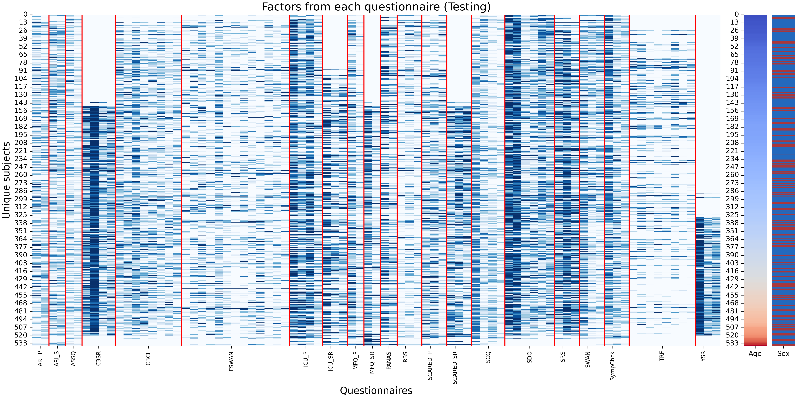
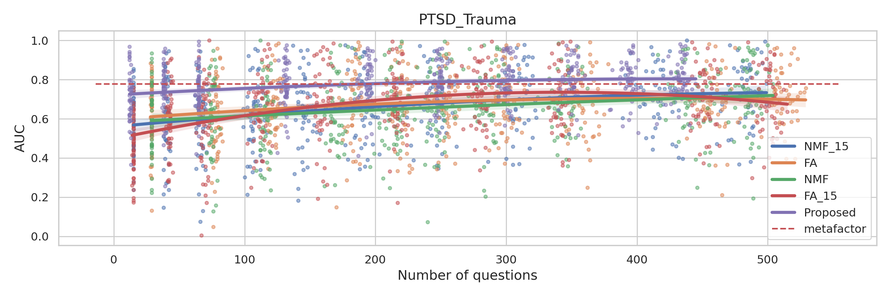

- [Meta-factor model: My God, it's full of Factors!](#meta-factor-model-my-god-its-full-of-factors)
  - [Introduction](#introduction)
  - [Historical background and motivation](#historical-background-and-motivation)
  - [What does this paper do?](#what-does-this-paper-do)
    - [Interpretable factorization of questionnaires](#interpretable-factorization-of-questionnaires)
    - [Meta-factorization of questionnaires](#meta-factorization-of-questionnaires)
    - [Micro-Meta-Factorization of questionnaires [need a better name]](#micro-meta-factorization-of-questionnaires-need-a-better-name)
    - [Prediction on Structural Brain Imaging](#prediction-on-structural-brain-imaging)

# Meta-factor model: My God, it's full of Factors!

## Introduction

## Historical background and motivation

- many questionnaires developed at different points in time, to get at different aspects of psychopathology
- generally, a questionnaire assumes one or more latent constructs, and is designed so that the presence of these can be quantified, e.g. by
  - calculation of subscales corresponding to the constructs (e.g. by tallying positive answers)
  - (exploratory/confirmatory) factor analysis of responses, with factors representing the degree to which a factor is present in each respondent
- problem 1: factor models are not necessarily interpretable
- problem 2: redundancy across questionnaires
- problem 3: no neurobiological basis for constructs

## What does this paper do?

### Interpretable factorization of questionnaires

- We introduce a new approach for factoring questionnaires that yields more interpretable factors, and apply it to CBCL and SDQ from HBN
- qualitative assessment: show the questions associated with factors, and that some factors can cross subscales
**CBCL question factor (proposed)**

  

  
Loadings of each CBCL question factor

  
  
  
  
  
  
  
  
  

  

  
CBCL question factor (Factor Analysis, promax rotation)

  
  

  

  
CBCL question factor (Subscale)

  
  

- quantitative assessment: show that the diagnostic classification performance from new factorization is indistinguishable for that using subscales or factors from factor analysis

- quantitative assessment: apply to ABCD as well, and show that the loadings for factors are very similar between HBN and ABCD

- how are our factors and subscales related (sankey plots for CBCL and SDQ)

### Meta-factorization of questionnaires

- We apply the interpretable factorization to the 21 questionnaires from the Healthy Brain Network dataset
- key point: compression does not lose information
- in the main paper, summarize main points (backed up by supplement)
  - who has filled what questionnaire
  
  
  

  
 Train-Validation-Test split 

    
    
    
  

  - compression rate table (for our method vs subscales, if available)
  
  - note that "disorder-specific" questionnaires don't do much better at predicting their respective diagnosis
  - possible heatmap: diagnosis vs scales (tile so that cross-domain instruments come first, then diagnostic-specific); ribbon of cross-diagnosis results do well
  - test per questionnaire (ours vs raw vs scale)

- in the supplement
  - repeat the qualitative and quantitative assessments of CBCL and SDQ, with their respective subscales (if available)
  - heatmaps for FA
  

- We introduce a second level interpretable factorization approach -- meta-factors (factors of factors) -- and apply it to the factorizations of all the HBN questionnaires
- This yields a model with 15 meta-factors
  - level 1 (factors concatenated)
  
  

  

  
 Concatenated factors for validation and test set 

  Validation set
  
  
  Test set
  
  
  

  - level 2 (factors of factors)
  
- Evaluation
  - qualitative assessment: show that meta-factors can be questionnaire specific, or cross-questionnaire (group together questions across questionnaires meaningfully)
  

  - this is done using the diagram for the meta-factor structure, but then also the top questions per meta-factor (showing questionnaire provenance)
  
  - quantitative assessment: show that the diagnostic classification performance from meta-factorization is indistinguishable for that of the best factorization for each questionnaire
  

### Micro-Meta-Factorization of questionnaires [need a better name]

Finally, it did not escape our notice that the process to generate the 15 meta-factors immediately suggests a possible approach to reducing the original thousands of questions to a much smaller, equivalently informative subset.

- We introduce an approach to identify a reduced set of informative questions:
  - learn factor models for each questionnaire
  - learn meta-factor model
  - identify top X questions in each meta-factor
  - redo the entire process using only those questions

  

- Evaluation (as we reduce the number of questions)
  - the diagnostic performance decays very slowly

  

  

  

  

  
Other diagnostic prediction

  
  
  
  
  
  
  
  
  
  
  
  
  
  
  

  - can we reconstruct individual questionnaires?

  - correlation between meta-factors extracted using different numbers of questions decays very slowly (meta-factors are very robust)
  Question sorted according to R-squared of 'full' matrix reconstruction
  
  Question sorted according to R-squared per experiment
  
- Based on our results, we believe that meta-factors can be acceptably recovered from as few as TODO questions per metafactor.
Answer: Top 10 per metafactor?
- "How low can you go?.." (LIMBO?)

- compare with CBCL and SDQ (roughly the same \# of questions)

- are there SDQ questions in every factor? (yes, in all but communication/ASD and anxiety factors)

 Top 10 questions in each metafactor 

### Prediction on Structural Brain Imaging

[Brain Test](/figure/brain/brain_test.html)